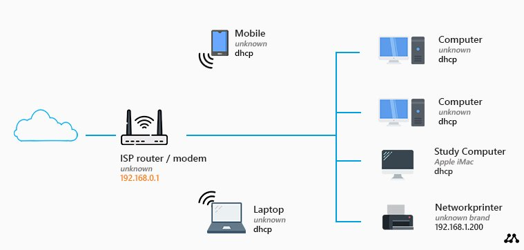
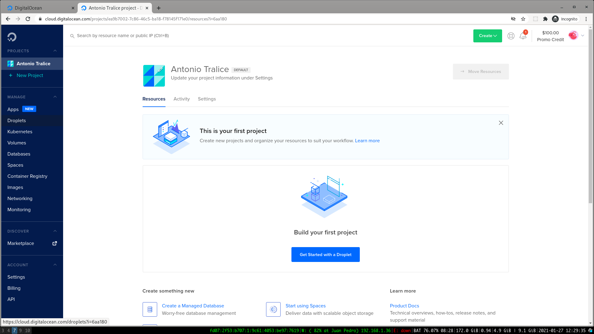

<p >
  
</p>

# wks-deployment

Hasta ahora hemos trabajado siempre en nuestro `localhost`, es decir, accedemos desde el browser a recursos que están en nuestra propia compu:


Esto quiere decir que sólo nosotros, y aquellos que estén conectados a nuestra misma red (por ejemplo: otra compu conectada en nuestra casa), van a poder acceder a los recursos que tengamos servidos -por ejemplo, nuestra API-.



En la imagen vemos una red LAN (Local Area Network) típica de una casa. Dentro de la red tenemos varios dispositivos conectados. Imaginemos que nuestra compu tiene corriendo un servidor web hecho en Node en el puerto `8080`.

Nosotros accedemos a la compu através de la URL `http://localhost:8080`.


`localhost` es un nombre que se le da por defecto a la dirección IP `127.0.0.1`, que es una dirección que apunta a nuestro propio host -nuestra compu-.
Por lo tanto cuando escribimos: `http://localhost:8080` estamos accediendo a nuestra propia compu al puerto 8080.


Bien, ahora si quisieramos acceder a nuestro server desde otro dispositivo, por ejemplo: un celular, tendríamos que conocer la dirección IP de nuestra compu -la que tiene el server corriendo- y acceder a esa IP y al puerto donde está escuchando:

`http://192.168.0.21:8080`

Genial, logramos acceder al servidor desde cualquier dispositivo conectado en la misma red. Ahora podríamos servir una página web o una app desde nuestro host para quienes vivan en casa.

> [Como conocer la dirección IP de tu compu](https://computerhoy.com/paso-a-paso/internet/como-saber-cual-es-direccion-ip-mi-ordenador-24347)

## Accediendo desde otras redes

Bien, ahora seguro se preguntarán: ¿Cómo hago si quiero que alguien que no esté en mi misma red se conecte a mi web?

Para esto es necesario contar con un servidor con una **IP pública**. Es decir una dirección IP que no cambie nunca y única que haya sido asiganda a nuestro server.

Las **IP privadas**, en cambio, se pueden repetir ya que son usadas internamente dentro de redes domésticas o privadas. De hecho, las IPs públicas usadas para este tipo de redes son las siguientes:

- 10.0.0.0 a 10.255.255.255
- 172.16.0.0 a 172.31.255.255
- 192.168.0.0 a 192.168.255.255
- 169.254.0.0 a 169.254.255.255

Seguramente en sus casas tengan alguna de esas direcciones por defecto!!

## Obteniendo un servidor con IP Publica

Ya sabemos que para poder hacer accesible nuestra App o web a todo el mundo necesitamos una IP publica, para esto vamos a tener que contratar los servicios de algún hosting. Justamente, estos servicios ofrecen la posibilidad de contratar un host virtual en la nube con una IP pública.

Hay muchas empresas que ofrecen lo mismo, y de distintos sabores: Algunos venden una máquina virtual directamente, otros un servicio donde subis el código y ellos se encargan de servirlo, etc...

Nosotros vamos a contratar los servicios de Digital Ocean, que ofrece un periódo de prueba gratis de 60 días.
Tambien podemos usar otros como AWS (tambien es gratis, pero te piden que ingreses tarjeta de crédito), o Heroku (este última no te da una máquina virtual, si no que podemos subir tu código y ellos lo ejecutan).

## Deployando en Digital Ocean

Para empezar vamos a crear una cuenta en Digital Ocean con este [link](https://m.do.co/c/b8d991ae6580).


Les debería llegar un email con un link de confirmación a la cuenta con la que se registraron!
Una vez confirmado su email deberán ingresar una tarjeta de crédito o cuenta de PayPal para acceder al free trial.

> AWS tambien exige poner la Tarjeta de crédito para obtener el free trial, de todos modos no te cobran nada.


Una vez confirmada la TC verán la confirmación que tienen su crédito. Si hacen click en el botón van a pasar a una ventana de Welcome que vamos a saltear, para ir al panel de control.



Dentro del panel, vamos a ir a la sección de `Droplets` que es la forma de Digital Ocean de llamarle a una máquina virtual (VPS -Virtual Private Server).
Dentro de Droplets vamos a clickear en `Create Droplet`.


En esta pantalla vamos a ver que podemos configurar nuestra máquina virtual. Podemos elegir el sistema operativo, y tambien las prestaciones de hardware.Mientras mayor prestaciones (más CPU, más disco, etc...) será más caro el alquiler que tengamos que pagar.

Vamos a seleccionar Ubuntu y la máquina más barata.


Ahora vamos a configurar nuestra password y el nombre del host para luego poder conectarnos a traves de internet a nuestra compu virtual!

Finalmente vamos abajo de todo y creamos el droplet. (Digital Ocean ofrece el servicio de Back ups, o de redes privadas y de storage, pero para nuestro ejercicio no es necesario, y no son gratis!).


Genial! Ya tenemos nuestro propia máquina virtual que vamos a usar como servidor web. De hecho, ya podemos visualizar la dirección **IP pública** que nos asignaron. Cuando ingresemos a nuestro server, vamos a hacerlo a través de esa IP.


> Para conectarse a la terminal (consola) del host remoto -nuestra máquina virtual- vamos a usar el comando `ssh`. Como argumentos le pasamos el siguiente querystring: `{usuario}@{ip}`. En este caso el user es `root`, y la `ip` la del server -que vimos más arriba en el dashboard de Digital Ocean-.

> Los que tienen windows pueden usar el [putty](https://www.putty.org/) para conectarse. Acá una [guía](https://www.digitalocean.com/docs/droplets/how-to/connect-with-ssh/putty/) paso a paso.

### Dentro de nuestra máquina virtual

Bien, ahora que estamos dentro de nuestro host, vamos a poder instalar el mismo software cómo lo haciamos en nuestra compu y ejecutarlo. Es decir que tenemos que instalar `node` y `npm`, instalar las dependecias (tambien instalar la Base de datos si necesitamos una, etc...).

#### Node y NPM

Recordemos que en este host tenemos instalado Ubuntu 20.04. Una buena forma para instalar `node` y `npm` es a través de `node version manager` (nvm). Para instalarlo escribimos el siguiente comando: 

`curl -o- https://raw.githubusercontent.com/nvm-sh/nvm/v0.35.3/install.sh | bash`

Esto va a instalar `nvm` en nuetro host. Ahora para poder usarlo debemos escribir el siguiente comando:

`source ~/.bashrc`

Ahora tenemos disponible el comando `nvm` que nos sirve para gestionar versiones de node, vamos a instalar la última versión estable:

`nvm install --lts`

Si escribimos `node -v` y vemos la versión, entonces ya tenemos instalado node!


Genial! Ahora ya tenemos Node en el server, para probarlo vamos a correr el siguiente server básico en Node y ejecutarlo:
Creamos el archivo server.js:

```js
const http = require('http');

http.createServer(function (req, res) {
  res.write('Hola, Mundo!');
  res.end();
}).listen(8080);
```

Y lo ejecutamos: `node server.js`

Ahora vamos a la **IP Pública** de nuestro server desde el browser -no olvidar el puerto donde pusimos a escuchar al server-:


Genial!
Ahora a quien sea que le compartas esa dirección va a poder ingresar a tu server!

### HomeWork

Ahora que ya tenés las herramientas para deployar una app de Node en Digital Ocean, intentá deployar tu proyecto individual en un `droplet` y compartir ela IP con tus compañeros!
